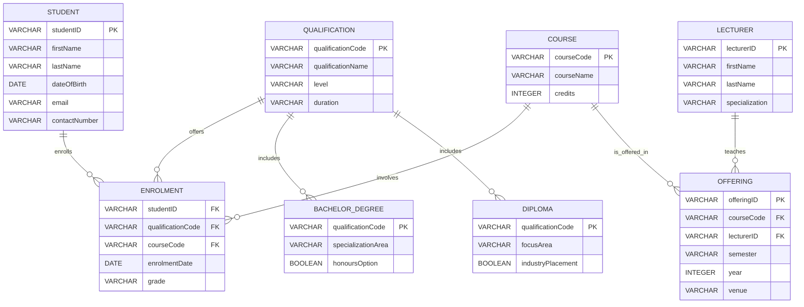

# Step-by-Step Design of the ERD

This document explains, step by step, how the Entity-Relationship Diagram (ERD) below was designed to meet the assignment instructions for the Department of Electrical, Electronic and Computer Engineering.

---

## 1. **Understand the Requirements**

From the assignment:

- There are multiple undergraduate qualifications.
- Each student can enrol for one qualification at a time.
- The ERD must include:
  - A ternary relationship
  - Generalisation
  - Specialisation
- At least 5 entities, with referential integrity constraints.
- Explanations and attribute domains are required.

---

## 2. **Identify and Define Entities**

Based on the scenario, the following real-world objects were modeled as entities:

- **STUDENT**: Represents each student.
- **QUALIFICATION**: Represents all undergraduate qualifications.
- **COURSE**: Represents individual courses in qualifications.
- **LECTURER**: Represents faculty members teaching courses.
- **ENROLMENT**: Captures the act of a student enrolling for a course as part of a qualification.
- **OFFERING**: Represents a specific instance of a course being taught in a semester by a lecturer.
- **BACHELOR_DEGREE** and **DIPLOMA**: Represent specific types of qualifications with unique attributes.

---

## 3. **Define Relationships**

### a. Basic Relationships

- **STUDENT–ENROLMENT**: A student enrols in an enrolment record.
- **QUALIFICATION–ENROLMENT**: The enrolment record refers to a specific qualification.
- **COURSE–ENROLMENT**: The enrolment record refers to a specific course.
- **LECTURER–OFFERING**: Each course offering is taught by a lecturer.
- **COURSE–OFFERING**: Each course can be offered multiple times in different semesters.

### b. **Ternary Relationship**

To model the fact that a student enrols for a course as part of a qualification, a ternary relationship is used:

> **ENROLMENT** entity connects **STUDENT**, **QUALIFICATION**, and **COURSE**.

This means the ENROLMENT table has foreign keys referencing all three entities.

---

## 4. **Apply Generalisation and Specialisation**

- **Generalisation**:  
  The entity **QUALIFICATION** captures shared attributes of all qualifications (e.g., code, name, duration).
- **Specialisation**:  
  The entities **BACHELOR_DEGREE** and **DIPLOMA** inherit from **QUALIFICATION**, each adding unique attributes (e.g., `specializationArea`, `honoursOption` for Bachelor Degrees; `focusArea`, `industryPlacement` for Diplomas).

This structure allows new types of qualifications to be added in the future without schema redesign.

---

## 5. **Define Attributes and Attribute Domains**

For each entity, attributes and their domains were chosen. For example, for **STUDENT**:

- `studentID`: VARCHAR (Primary Key)
- `firstName`, `lastName`: VARCHAR
- `dateOfBirth`: DATE
- `email`: VARCHAR
- `contactNumber`: VARCHAR

Similar attribute definitions were made for other entities, ensuring that each key uniquely identifies records and that data types are appropriate.

---

## 6. **Enforce Referential Integrity**

Foreign keys are included in:

- **ENROLMENT**: `studentID` (FK), `qualificationCode` (FK), `courseCode` (FK)
- **OFFERING**: `courseCode` (FK), `lecturerID` (FK)

This ensures that enrolments and offerings always reference valid students, qualifications, courses, and lecturers.

---

## 7. **Ensure Minimum Number of Entities**

The design includes more than 5 entities:  
STUDENT, QUALIFICATION, COURSE, LECTURER, ENROLMENT, OFFERING, BACHELOR_DEGREE, DIPLOMA.

---

## 8. **Draw the ERD**

The diagram below was constructed using MermaidJS syntax.  
It visually represents the entities, relationships (including the ternary), and generalisation/specialisation hierarchy.

---

## 9. **Explain Generalisation and Specialisation**

- **Generalisation**:  
  The `QUALIFICATION` entity groups all attributes common to all types of qualifications, reducing redundancy.

- **Specialisation**:  
  The `BACHELOR_DEGREE` and `DIPLOMA` entities are specialisations of `QUALIFICATION`, each with attributes specific to their type.

---

## 10. **Attribute Domain Example**

**STUDENT Entity Attribute Domains:**

| Attribute     | Domain  | Description                     |
| ------------- | ------- | ------------------------------- |
| studentID     | VARCHAR | Unique identifier for a student |
| firstName     | VARCHAR | Student's first name            |
| lastName      | VARCHAR | Student's last name             |
| dateOfBirth   | DATE    | Date of birth (YYYY-MM-DD)      |
| email         | VARCHAR | Student's email address         |
| contactNumber | VARCHAR | Student's contact phone number  |

---

## **Summary**

This ERD was designed step by step to satisfy all assignment requirements.  
It demonstrates ternary relationships, generalisation, specialisation, referential integrity, and appropriate attribute domains, as required.
