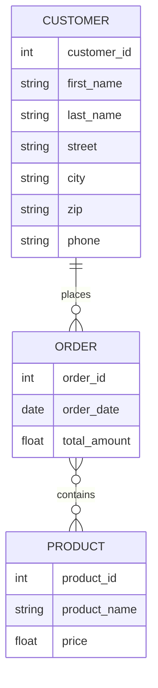
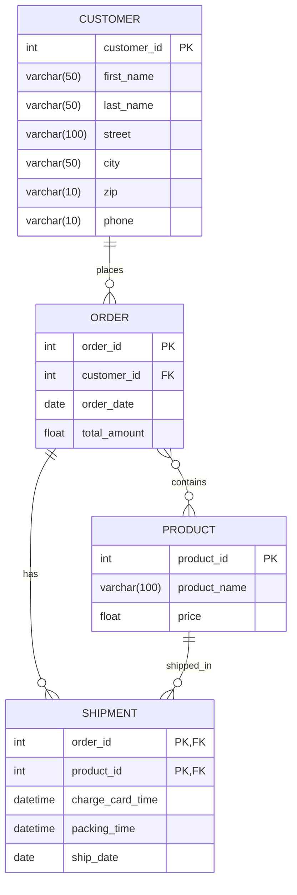

# ERD explanation

## Part 1

This lesson introduces Entity Relationship Diagrams (ERDs), which are visual tools used to model how data entities (such as customers, orders, and products) relate to each other within a database. The tutorial covers:

- **Entities:** Objects tracked in a database (e.g., Customer, Order, Product).
- **Attributes:** Properties of entities (e.g., Customer ID, Name).
- **Relationships:** How entities interact (e.g., a Customer places an Order).
- **Cardinalities:** The numerical nature of the relationships (e.g., one-to-many, zero-or-many).

**Example:**  
In an online store like Amazon:

- A Customer can place zero or many Orders.
- An Order must belong to exactly one Customer.
- An Order must contain one or many Products.
- A Product can belong to zero or many Orders.

The video also demonstrates using Lucidchart to create ERDs and highlights the ability to export diagrams for database implementation.

---

### Relationship Table

| Entity 1 | Relationship | Entity 2 | Minimum | Maximum |
| -------- | ------------ | -------- | ------- | ------- |
| Customer | places       | Order    | 0       | Many    |
| Order    | belongs to   | Customer | 1       | 1       |
| Order    | contains     | Product  | 1       | Many    |
| Product  | part of      | Order    | 0       | Many    |

---

### Mermaid Code Example

**Legend:**

- `||..o{` — One (and only one) to zero or many
- `}o..o{` — One or many to zero or many

## Part 2

### Summary of Part 2: Advanced ERD Concepts

This video builds on the basics of Entity Relationship Diagrams (ERDs) by covering more advanced concepts:

- **Primary Keys (PK):**  
  A unique, unchanging, and non-null attribute that identifies each record in a table (e.g., `customer_id` for customers). Names and addresses aren't suitable since they can change or be duplicated, so IDs are standard.

- **Foreign Keys (FK):**  
  An attribute in one entity that references the primary key in another, establishing a relationship (e.g., `customer_id` in the Order entity references the Customer entity). Foreign keys can repeat and there can be multiple FKs in one entity.

- **Composite (Compound) Primary Keys:**  
  When a single attribute isn't unique, a combination of two or more attributes can uniquely identify a record (e.g., in a Shipment table, a composite PK of `order_number` + `product_id` ensures uniqueness).

- **Bridge Tables (Join Tables):**  
  Used to resolve many-to-many relationships by breaking them into two one-to-many relationships. For example, the Order entity acts as a bridge between Customer and Product, allowing tracking of which customer bought which product and when.

- **Data Types in ERDs:**  
  You can specify data types (e.g., `int`, `varchar(50)`) for each attribute to prepare for database implementation.

- **Exporting/Importing ERDs:**  
  Tools like Lucidchart can export ERDs as SQL code for various DBMS or even import existing databases to auto-generate ERDs, making the process of visualizing and building databases much faster.

---

### Relationship Table

| Entity 1 | Relationship | Entity 2 | Cardinality (Min, Max) | PK in Entity                         | FK in Entity         | Notes                                        |
| -------- | ------------ | -------- | ---------------------- | ------------------------------------ | -------------------- | -------------------------------------------- |
| Customer | places       | Order    | 0, Many                | customer_id                          | customer_id          | `customer_id` is PK in Customer, FK in Order |
| Order    | contains     | Product  | 1, Many                | order_id                             | product_id           | `order_id` is PK in Order, `product_id` FK   |
| Shipment | ships        | Product  | 1, Many                | order_id + product_id (composite PK) | order_id, product_id | Composite PK in Shipment                     |

---

### Mermaid Code Example (with PK, FK, Data Types, Composite Keys, and Bridge Table)

**Notes:**

- Use `PK` to indicate Primary Key and `FK` for Foreign Key in attribute comments.
- `SHIPMENT` demonstrates a composite primary key (`order_id` + `product_id`), each of which is also a foreign key.

This ERD diagram reflects the advanced concepts discussed: primary keys, foreign keys, composite keys, and the use of a bridge (shipment) table to model a many-to-many relationship. You can copy/paste the Mermaid code into any Mermaid-enabled editor to visualize.
